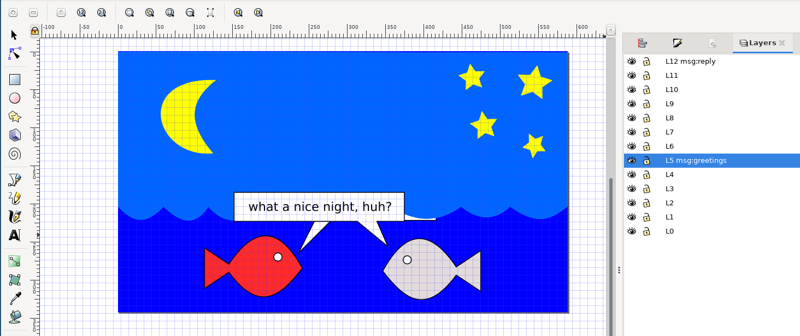

# General description

inklayers is a command line program that exports layers from an SVG file.
It can be used to create slide shows by editing a single SVG file.

By default the exported files are in SVG format too.
If [Inkscape](https://inkscape.org/) is found in the system, an automatic conversion of each single exported layer to Inkscape supported formats (png, pdf, ps, eps) can be done.

A project can be specified using a file format based on JSON, INI, or TOML formats.
The project file allows to specify complex organizations of layers to be combined into "slides".

The program automatically generates the code to include the slides within a LaTeX presentation that uses the [Beamer package](https://latex-beamer.com/).

If the content of an Inkscape session looks like the one in the following screenshot



the layers exported can be arranged in a slideshow, obtaining the following result:


# Rationale

I developed inklayers as a tool to make it easier to work at graphical content that could be used to arrange "animated" content in LaTeX Beamer presentations.

I always used Inkscape for drawing pictures for my LaTeX presentations, after moving from the venerable [XFig](http://mcj.sourceforge.net/).

However, working with one file for each "slide" was really cumbersome, mainly because the slides typically contain very similar content (they are meant to compose a slideshow, after all...), and making changes to one slide often requires to propagate the changes to many other files, making the approach almost unfeasible.

With inklayers there is only one SVG files containing all the graphical material of the slideshow, and changes to one layer are automatically replicated to all the slides during the export.

Although the organization of a slideshow still requires some attention, it is much more affordable.

# Compatibility

The extraction of layers in SVG format should work on any system.
I tested it under Linux only.

The conversion with Inkscape was tested using Inkscape version 0.91 and 1.1.1 under Ubuntu 20.04.

# Installing

From source:

```
git clone <repository>
```

```
cd <cloned-directory>
```

```
pip install -r requirements.txt
```

```
pip install --user .
```

# Examples

After installing, to test an example:

```
cd examples
```

run

```
inklayers fishes2.json
```

The exported layers and their conversions are saved in `output/` under the current directory.

Assuming that [Imagemagick](https://imagemagick.org/) is installed in the system, the slideshow as animated GIF in the above example can be obtained with the following command:

```
convert -delay 75 -loop 0 output/*.png slideshow.gif
```

# Reference to layers

Layers can be referenced by label or index (`#0`, #`1`, ...), or by layer's name.
The first layer has index 0.
Layer's interval is supported. Example format: `#1-#9`.

Layers can be selected for inclusion or exclusion.
If include/exclude options collide, the latest prevails.

# Project file format

An example project file look like the following:

```
{
  "input": {
    "filename": "fishes.svg"
  },
  "output": {
    "type": "pdf",
    "filename": "%b-%n.%e",
    "slides": [
      {"include": ["L0"]},
      {"include": ["L0", "L1"]},
      {"include": ["#0-#2"]},
      {"include": ["#0-#3"]},
      {"include": ["#0-#4"]},
      {"include": ["#0-#5"]},
      {"include": ["#0-#6"], "exclude": ["L5 msg:greetings"]},
      {"include": ["#0-#7"], "exclude": ["L5 msg:greetings"]},
      {"include": ["#0-#8"], "exclude": ["L5 msg:greetings"]},
      {"include": ["#0-#9"], "exclude": ["L5 msg:greetings"]},
      {"include": ["#0-#10"], "exclude": ["L5 msg:greetings"]},
      {"include": ["#0-#11"], "exclude": ["L5 msg:greetings"]},
      {"include": ["#0-#12"], "exclude": ["L5 msg:greetings"]},
      {"include": ["#0-#12"], "exclude": ["L5 msg:greetings", "L12 msg:reply"]}
    ]
  }
}
```

The project file allows to specify:

- the input file name
- the format of the generated slides (pdf, png, svg)
- the format of the filenames of the slides (`%b` is the basename of the input file, `%n` is an increasing ordinal number, `%e` is the extension)
- the list of slides

Each slide can be specified to include and/or exclude a set of layers.
